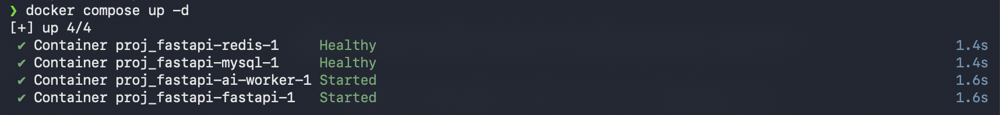
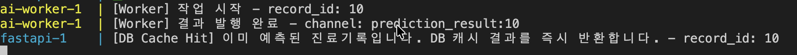

# EDA(Event-Driven Architecture) 적용확인 보고서

## 1. 아키텍처 및 구현 파일 검증

### 1) 구현 파일 링크

- **FastAPI 비동기 Redis 연결**: [redis_client.py](/app/core/redis_client.py)
- **FastAPI 예측 요청 및 Pub/Sub 처리**: [record_router.py](/app/apis/record_router.py)
- **AI Worker 동기 Redis 연결**: [redis_client.py](/worker/redis_client.py)
- **AI Worker 작업 큐 소비 및 Publish 루프**: [main.py](/worker/main.py)
- **의존성 분리 설정**: [pyproject.toml](/pyproject.toml)
- **도커 컴포즈 정의**: [docker-compose.yml](/docker-compose.yml)

### 2) 서비스 빌드 확인

- FastAPI 빌드 시 PyTorch 등의 대용량 패키지가 배제되고, AI Worker만 `ai` extra 의존성을 사용하여 타겟 이미지가 용량 최적화 상태로 빌드되었습니다.

---

## 2. 동작 확인 및 캡처 가이드

### [캡처 1] Docker 서비스 실행 상태 확인 (docker compose ps)

- **대상**: 터미널 창
- **명령어**: `docker compose ps`
- **확인 내용**: `fastapi`, `redis`, `ai-worker`, `mysql` 서비스가 모두 `Up` (healthy) 상태로 실행 중인지 확인
  

### [캡처 2] API 예측 요청

### [캡처 3] 캐싱 확인 (DB/메모리에 저장된 결과 중복 호출 방지)

- **대상**: 웹 브라우저의 Network 탭 혹은 FastAPI 터미널 로그
- **확인 내용**: 동일한 진료기록에 대해 'AI 예측 결과보기'를 다시 클릭했을 때, Redis나 AI Worker 측으로 새로운 작업(Task)이 전달되지 않고 기존 저장된 결과가 즉시 리턴
  
